# 🧠 SQL Guidebook using `bike_store.db`


# Overview

This project demonstrates **beginner-to-advanced SQL concepts** using the `bike_store.db` sample database.
The included Python script (`bike_store_queries.py`) connects to the SQLite database and executes a wide range of SQL queries — from basic data retrieval to complex analytics using subqueries, Common Table Expressions (CTEs), and window functions.

My goal is to **showcase how SQL can be used to answer real-world business questions** like sales performance, customer segmentation, seasonality trends, and product co-purchases.


## How to Run

1. **Ensure dependencies are installed**

   ```bash
   pip install pandas
   ```

2. **Run the script**

   ```bash
   python bike_store_queries.py
   ```

3. The script connects to the database, executes each query sequentially, and prints the top results for each.


## Database Schema

| Table         | Description                                             |
| ------------- | ------------------------------------------------------- |
| `customers`   | Contains customer personal details                      |
| `orders`      | Stores order transactions                               |
| `order_items` | Contains products included in each order                |
| `products`    | List of products with price, model year, and brand info |
| `categories`  | Product categories                                      |
| `staffs`      | Employee and manager information                        |
| `stores`      | Store locations                                         |


## Data Diagram
Below is the Data Diagram showing the realtionship between tables

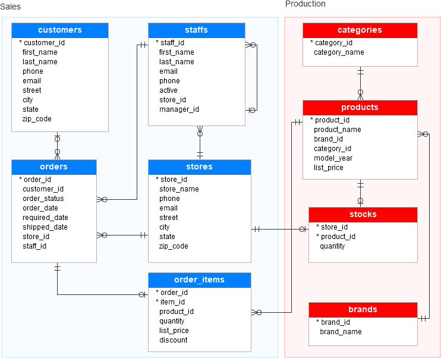

## SQL Queries Summary
Here is the summary of all the queries that we are going to look at.

----
| #  | Query / Concept                    | Question / Insight                                    | SQL Concept / Technique               |
| -- | ---------------------------------- | ----------------------------------------------------- | ------------------------------------- |
| 1  | Basic SELECT                       | Explore the structure and sample data of `customers`  | `SELECT *`, `LIMIT`                   |
| 2  | Filtered Customer List             | Customers located in New York                         | `WHERE` clause                        |
| 3  | Aggregation                        | Cities with the most customers                        | `GROUP BY`, `COUNT()`, `ORDER BY`     |
| 4  | Joins                              | Which customers placed which orders                   | `INNER JOIN`                          |
| 5  | Subquery – Price Above Average     | 2019 products priced above average                    | Subquery in `WHERE`                   |
| 6  | Subquery – High Discount Orders    | Orders with brand 9 products discounted ≥20%          | Subquery + `IN`                       |
| 7  | Subquery with EXISTS               | Orders with any product discounted ≥20%               | `EXISTS` subquery                     |
| 8  | CTE – Category-Level Sales         | Revenue, units, and total orders per product category | `WITH` (CTE), aggregation             |
| 9  | Recursive CTE – Employee Hierarchy | Reporting hierarchy among employees                   | `WITH RECURSIVE`, hierarchy           |
| 10 | Window Function – 30-Day Avg       | 30-day moving average of orders per store             | `WINDOW FUNCTIONS` (`AVG() OVER`)     |
| 11 | Customer Segmentation              | Classify customers by spending, frequency, recency    | CTE + `CASE` (RFM Analysis)           |
| 12 | Seasonality Analysis               | Seasonal trends in product category sales             | CTE + `GROUP BY` + `AVG()`            |
| 13 | Customer Ranking                   | Top customers by total transactions                   | `RANK() OVER` window function         |
| 14 | Market Basket Analysis             | Products frequently purchased together                | Self-join + aggregation               |
| 15 | Average Purchase Interval          | Average days between consecutive purchases            | `LAG()` window function + aggregation |
---


## SQL Queries


### **1. Basic SELECT**

**Question:**
What does the structure and data of the `customers` table look like?


We want to explore the structure and sample data of the customers table. This helps understand what columns are available and what kind of data is stored before running more advanced queries.

**Query:**

```sql
SELECT * FROM customers LIMIT 5;
```
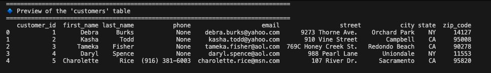

**Notes / Interpretation:**

* Retrieves the first 5 rows to quickly inspect data.
* Helps understand how to reference columns in later queries.
* Avoid `SELECT *` on large tables without limits to prevent performance issues.


---

### **2. Filtered Customer List**

**Question:**
Who are the customers located in New York?

We use the WHERE clause to filter data. This helps understand regional customer bases and supports location-specific campaigns.

```sql
SELECT first_name, last_name, email FROM customers WHERE city = 'New York';
```

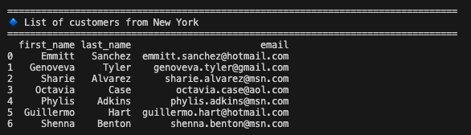

**Notes / Interpretation:**

* Filters only relevant rows.
* Only selects required columns for efficiency.
* SQLite is case-insensitive by default; other databases may require `UPPER()` or `LOWER()`.

---

### **3. Aggregation**
**Question:**
Which cities have the most customers?

The GROUP BY and COUNT() aggregation functions summarize how many customers belong to each city. Ranking them using ORDER BY helps identify the strongest customer markets.

```sql
SELECT city, COUNT(customer_id) AS total_customers
FROM customers
GROUP BY city
ORDER BY total_customers DESC;
```
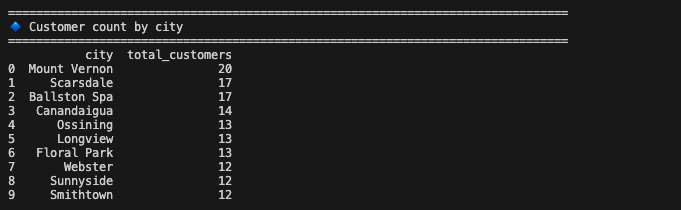

**Notes / Interpretation:**

* `GROUP BY` aggregates customers per city.
* `ORDER BY ... DESC` highlights largest markets.
* Watch for NULL or empty cities; they will be grouped separately.


---

### **4. Joins**

**Question:**
Which customers placed which orders?

JOIN is used to combine customer information with their orders. This query connects relational data and provides an overview of customer purchase activity.

```sql
SELECT customers.first_name || ' ' || customers.last_name AS customer_name,
       orders.order_id, orders.order_date
FROM customers
INNER JOIN orders ON customers.customer_id = orders.customer_id;
```
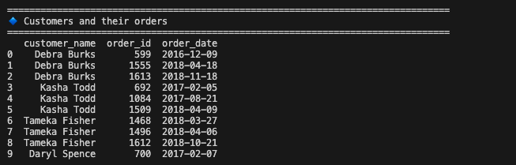

**Notes / Interpretation:**

* `INNER JOIN` ensures only customers with orders appear.
* Use `LEFT JOIN` if you want all customers, including those without orders.
* Concatenation (`||`) creates readable full names.

---

### **5. Subquery – Price Above Average**

**Question:**
Which 2019 models are priced above the average price of all 2019 products?

We use a subquery to calculate the average price for 2019 models, then filter only those above this threshold. It’s a powerful example of comparative filtering.

```sql
SELECT *
FROM products
WHERE model_year = 2019
AND list_price > (
    SELECT AVG(list_price)
    FROM products
    WHERE model_year = 2019
);
```
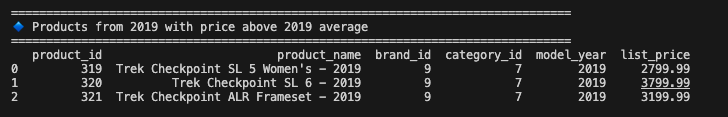


**Notes / Interpretation:**

* Inner query calculates the average price for 2019 models.
* Outer query filters products above average.
* Useful for **pricing strategy** and inventory prioritization.
* Watch for NULLs in `list_price`.

---

### **6. Subquery – Orders with High Discounts (brand 9)**

**Question:**
Which orders include discounted products from brand 9 with at least 20% off?

We first find all order_ids that meet the brand and discount condition, then retrieve corresponding orders. This is a filtering by subquery use case.

```sql
SELECT DISTINCT order_id, customer_id
FROM orders
WHERE order_id IN (
    SELECT DISTINCT order_id
    FROM order_items
    INNER JOIN products
    ON order_items.product_id = products.product_id
    AND brand_id = 9
    AND discount >= 0.20
);
```
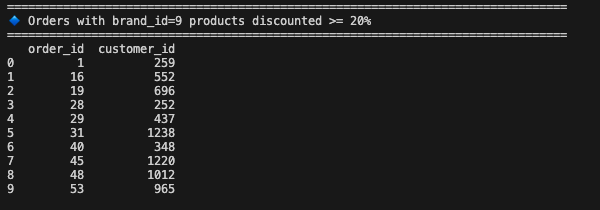

**Notes / Interpretation:**
* `IN` subquery checks orders meeting discount conditions.
* `DISTINCT` avoids duplicates.
* Use `EXISTS` for better performance on large datasets.
---

### **7. Subquery with EXISTS**
**Question:**
Which orders have **any** product with a discount of 20% or more?

The EXISTS keyword checks for the existence of a condition in a related table — more efficient than IN for large datasets.

```sql
SELECT DISTINCT order_id, customer_id
FROM orders
WHERE EXISTS (
    SELECT 1
    FROM order_items
    WHERE discount >= 0.20
    AND order_items.order_id = orders.order_id
);
```

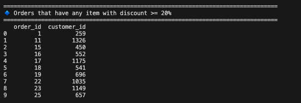

**Notes / Interpretation:**

* `EXISTS` returns true if subquery finds any matching row.
* Typically faster than `IN` for large tables.
* Results help identify high-discount order patterns.


---

### **8. CTE – Category-Level Sales**
**Question:**
How much revenue, how many units, and how many orders were made per product category?

The Common Table Expression (CTE) simplifies intermediate logic: compute per-line revenue first, then aggregate at the category level. It’s cleaner and modular compared to nested queries.

```sql
WITH category_sales AS (
    SELECT DISTINCT
        order_id, order_items.product_id, quantity,
        order_items.list_price, quantity * order_items.list_price AS line_subtotal, category_id
    FROM order_items
    INNER JOIN products ON order_items.product_id = products.product_id
)
SELECT category_id, SUM(line_subtotal) AS revenue, SUM(quantity) AS units_sold,
       COUNT(DISTINCT order_id) AS total_orders
FROM category_sales
GROUP BY 1
ORDER BY 2 DESC;
```

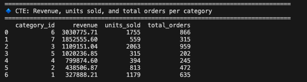

**Notes / Interpretation:**

* CTE computes a reusable temporary table for category-level metrics.
* `DISTINCT` avoids duplicate orders.
* Useful for **sales performance dashboards**.

---

### **9. Recursive CTE – Employee Hierarchy**
**Question:**
What is the reporting hierarchy among employees and managers?

A recursive CTE helps navigate hierarchical data (e.g., org charts). It starts with managers (manager_id IS NULL) and recursively expands to all subordinates.

```sql
WITH RECURSIVE employee_hierarchy AS (
    SELECT staff_id, manager_id, first_name || ' ' || last_name AS full_name
    FROM staffs
    WHERE manager_id IS NULL
    UNION ALL
    SELECT t2.staff_id, t2.manager_id, t2.first_name || ' ' || t2.last_name AS full_name
    FROM staffs t2
    INNER JOIN employee_hierarchy eh ON t2.manager_id = eh.staff_id
)
SELECT * FROM employee_hierarchy;
```

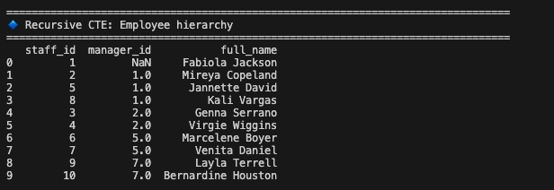

**Notes / Interpretation:**

* Recursive CTE repeats queries to build hierarchical relationships.
* First SELECT captures top-level managers.
* Second SELECT iteratively joins subordinates.
* Useful for HR dashboards or reporting structures.

---

### **10. Window Function – 30-Day Moving Average**

**Question:**
What is the 30-day moving average of orders for each store?

Window functions allow analyzing trends over time. By using ROWS BETWEEN, we create a rolling average of orders for each store — revealing sales patterns.

```sql
WITH daily_orders AS (
    SELECT order_date, store_id, COUNT(*) AS orders
    FROM orders
    GROUP BY 1,2
)
SELECT order_date, store_id,
       AVG(orders) OVER(PARTITION BY store_id ORDER BY order_date ASC ROWS BETWEEN 14 PRECEDING AND 15 FOLLOWING)
       AS moving_avg_30d
FROM daily_orders;
```

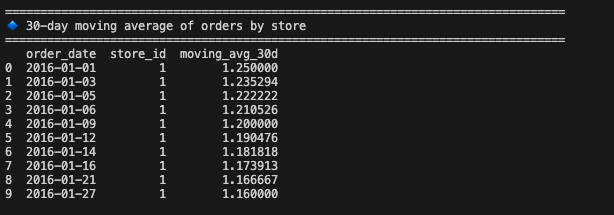

**Notes / Interpretation:**

* `WINDOW FUNCTION` calculates rolling averages per store.
* `ROWS BETWEEN 14 PRECEDING AND 15 FOLLOWING` ensures 30-day window.
* Helps **forecast demand** and detect trends.
---

### **11. Customer Segmentation**

**Question:**
How can customers be classified based on their spending, recency, and frequency?

This query uses CTEs and conditional logic (CASE) to build RFM segmentation — a marketing framework for understanding customer behavior.

```sql
WITH customer_stats AS (
    SELECT customer_id,
           SUM(quantity * list_price * (1 - discount)) AS total_spent,
           COUNT(DISTINCT orders.order_id) AS total_orders,
           julianday('2018-12-29') - julianday(MAX(order_date)) AS days_since_last_purchase
    FROM orders
    INNER JOIN order_items ON orders.order_id = order_items.order_id
    GROUP BY 1
)
SELECT customer_id,
       CASE WHEN total_orders > 1 THEN 'repeat buyer' ELSE 'one-time buyer' END AS purchase_frequency,
       CASE WHEN days_since_last_purchase < 90 THEN 'recent buyer' ELSE 'not recent buyer' END AS purchase_recency,
       CASE WHEN total_spent/(SELECT MAX(total_spent) FROM customer_stats) >= .65 THEN 'big spender'
            WHEN total_spent/(SELECT MAX(total_spent) FROM customer_stats) <= .30 THEN 'low spender'
            ELSE 'average spender' END AS buying_power
FROM customer_stats;
```
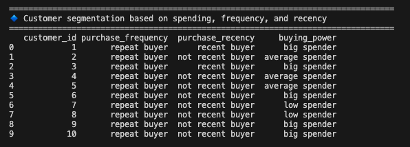

**Notes / Interpretation:**

* Segments customers for **marketing and loyalty programs**.
* CTE simplifies calculations for later filtering and categorization.
* Be mindful of customers with **no orders**; they will not appear.


---

### **12. Seasonality Analysis**

**Question:**
Which product categories show seasonal trends in sales?

By aggregating sales by month, we can identify seasonal peaks. This informs inventory planning and marketing efforts (e.g., promoting mountain bikes in summer).

```sql
WITH product_categories AS (
    SELECT product_id, category_name
    FROM products
    INNER JOIN categories ON products.category_id = categories.category_id
),
product_sales_ym AS (
    SELECT strftime('%Y', order_date) AS year,
           strftime('%m', order_date) AS month,
           product_id,
           SUM(quantity) AS units_sold
    FROM orders
    INNER JOIN order_items ON orders.order_id = order_items.order_id
    GROUP BY 1,2,3
)
SELECT month, category_name, AVG(units_sold) AS avg_units_sold
FROM product_sales_ym
INNER JOIN product_categories ON product_sales_ym.product_id = product_categories.product_id
GROUP BY 1,2;
```
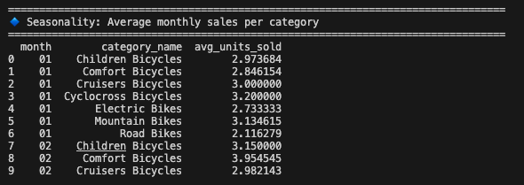

**Notes / Interpretation:**

* Aggregates **monthly sales per category**.
* Useful for **inventory planning** and promotional campaigns.
* Watch for months with no orders; they will be ignored.

---

### **13. Customer Ranking**

**Question:**
Who are the top customers by total number of transactions?

Ranking functions (RANK() OVER) are ideal for leaderboards. This query helps sales teams identify the most loyal or valuable customers.

```sql
SELECT c.first_name || ' ' || c.last_name AS customer_name,
       COUNT(s.order_id) AS total_transactions,
       RANK() OVER (ORDER BY COUNT(s.order_id) DESC) AS rank
FROM orders s
INNER JOIN customers c ON s.customer_id = c.customer_id
GROUP BY 1
ORDER BY 2 DESC;
```
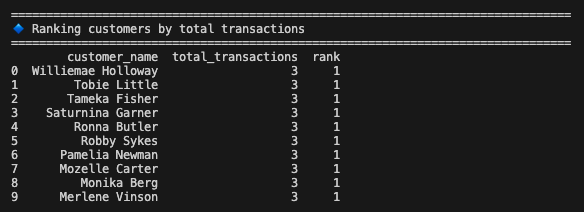

**Notes / Interpretation:**

* `RANK()` provides ranking of customers by number of transactions.
* Helps identify **loyal or high-activity customers**.
* Use `DENSE_RANK()` if you want no gaps in ranking.

---

### **14. Market Basket Analysis**

**Question:**
Which products are most frequently purchased together?

By joining order_items on itself, we detect pairs of items bought in the same order — a foundation for recommendation systems and product bundling.

```sql
SELECT product_a, product_b, co_purchase_count
FROM (
     SELECT p1.product_name AS product_a, p2.product_name AS product_b,
            COUNT(*) AS co_purchase_count
     FROM order_items s1
     INNER JOIN order_items s2 ON s1.order_id = s2.order_id AND s1.product_id <> s2.product_id
     INNER JOIN products p1 ON s1.product_id = p1.product_id
     INNER JOIN products p2 ON s2.product_id = p2.product_id
     GROUP BY p1.product_id, p2.product_id
    ) subquery
ORDER BY co_purchase_count DESC;
```
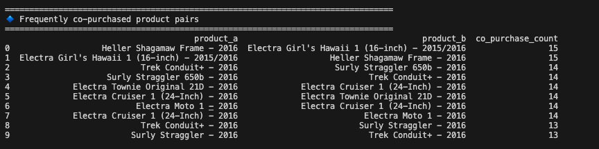

**Notes / Interpretation:**

* Inner join checks all product pairs in the same order.
* Results help design **bundles and promotions**.
* Be careful: duplicate pairs (A,B) and (B,A) may appear; deduplicate if needed.

---

### **15. Average Purchase Interval**
**Question:**
How many days on average pass between consecutive purchases for each customer?

Using LAG() to find each customer’s previous purchase date allows us to measure time between orders — a key customer engagement metric.

```sql
SELECT customer_id,
       AVG(julianday(order_date) - julianday(prev_order_date)) AS avg_days_between_purchases
FROM (
     SELECT c.customer_id, order_date,
            LAG(order_date) OVER (PARTITION BY c.customer_id ORDER BY order_date) AS prev_order_date
     FROM orders o
     INNER JOIN customers c ON o.customer_id = c.customer_id
    ) subquery
WHERE prev_order_date IS NOT NULL
GROUP BY 1;
```
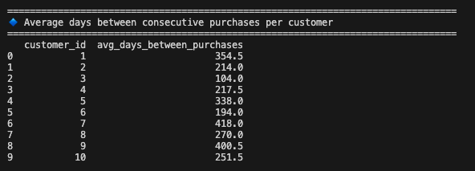

**Notes / Interpretation:**

* `LAG()` provides the previous order date per customer.
* AVG calculates **typical purchase frequency**, useful for loyalty programs.
* Excludes first purchase (no previous date).

---


## 📈 Insights & Applications

* **Sales Teams:** Identify top-selling categories and repeat buyers.
* **Marketing Teams:** Segment customers for targeted campaigns.
* **Inventory Teams:** Forecast demand based on seasonality and co-purchase patterns.
* **Executives:** Analyze overall sales trends and employee hierarchy.


## 📜 Author

- Author: PRANSHUL BHATNAGAR  
- Date: 17 October 2025  
